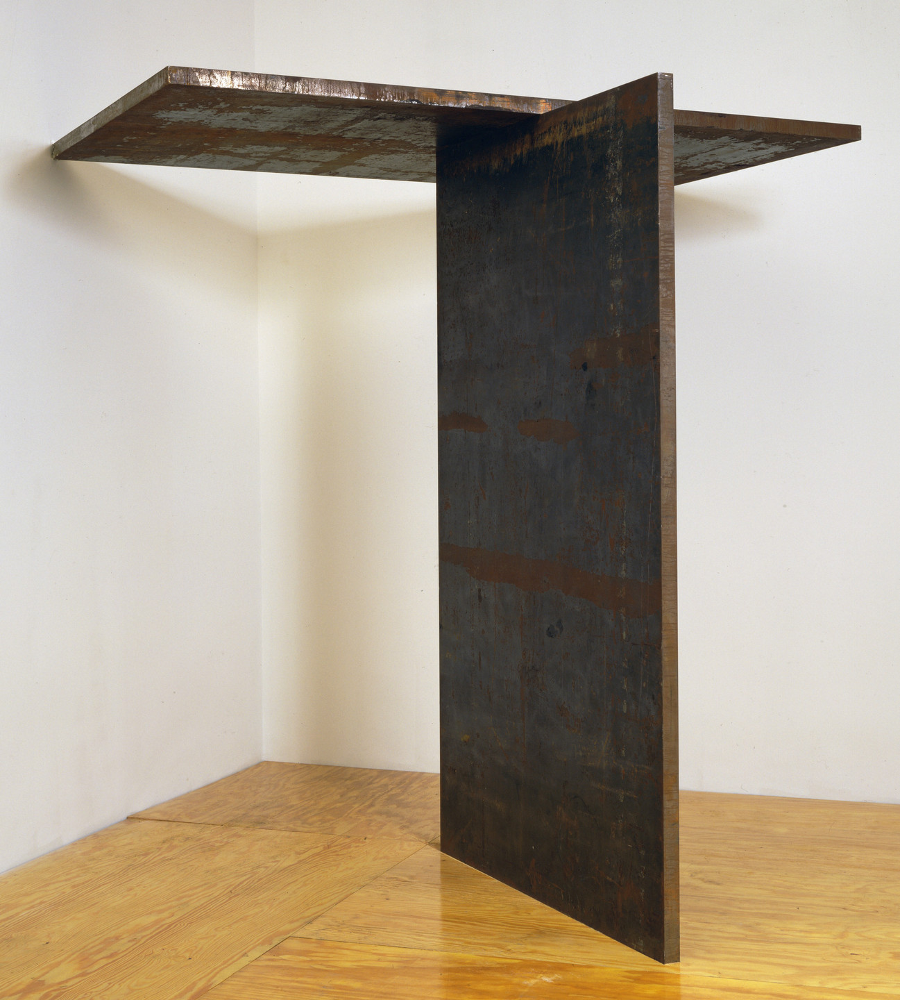

When browsing around the galleries at the Asian Art Museum in San Francisco, I had a profound realization that unifies some of the seemingly odd things I like. [Matte finish chairs](https://shop.steelcase.com/products/lessthanfive-guest-chair?variant=41536661454983), [rusty metal](https://www.sfmoma.org/artist/Richard_Serra/), [concrete](https://www.tate.org.uk/visit/tate-modern/display/tanks), [shoegaze](https://youtu.be/531rtzMGh2U), [screamo](https://en.wikipedia.org/wiki/Doppelg%C3%A4nger_(The_Fall_of_Troy_album)), [abandoned places](https://www.uer.ca/forum_showthread.asp?fid=1&threadid=135516). What unifies these things? A sense of *roughness*. For an everyday object, tactility; for a museum piece, implied tactility. I can feel myself touching these things in my mind's eye.

I had a single day in SF to experience the museums, forcing me to look rather hastily. Rather than focusing heavily on individual pieces, this led me to form generalizations about the pieces, divorced from their context and history (which can only be learned through reading their plaques, which I did not have time for). This naturally made me focus on things like materials, texture, and colour, which can be picked up quickly. I looked at pieces through a purely aesthetic lens, and not their context or what they have to say (e.g. in terms of material history). My experiences on this day led me to consider a unified theory of "roughness"; an attempt to understand the appeal of rough items from a philosophical and psychological lens. I would be interested to know if others have similar feelings about rough items, textures, and sounds. Even if one does not necessarily have the same phenomenological experience of roughness as I do, I hope that the ideas I discuss here can be useful or the subject of further thought.

To discuss the nature of the "rough", we must define it. How should we define roughness? We can define the physical quality of roughness as the antithesis of smoothness. Likewise, we may find value in exploring the abstract qualities of roughness by contrasting them with the abstract qualities of smoothness and perfection (hence why we call an unfinished product a "rough draft", in contrast to the finished "final draft"). Finally, to me, roughness is fundamentally tied to the eerie and uncanny. My appreciation of rough items is usually associated with an uncanny feeling (e.g., exploring an abandoned house). Therefore, it is worth exploring the nature of the uncanny as a proxy for understanding the nature of the rough.

### From a Psychoanalytic Lens

> If psychoanalytic theory is correct in maintaining that every emotional affect, whatever its quality, is transformed by repression into morbid anxiety, then among such cases of anxiety there must be a class in which the anxiety can be shown to come from something repressed which recurs. This class of morbid anxiety would then be no other than what is uncanny, irrespective of whether it originally aroused dread or some other affect... this uncanny is in reality nothing new or foreign, but something familiar and old—established in the mind that has been estranged only by the process of repression.
>
> * From Freud's [*The Uncanny*](https://web.mit.edu/allanmc/www/freud1.pdf)

Freud thought that the uncanny was caused by the re-appearance of a previous experience in a different context or time; something "repressed" has surfaced again. There is a parallel there to pieces displayed in a museum; while they are not really something resurfaced from a previous life experience, they *are* re-contextualized and de-contextualized; museum pieces are taken from their original locations and placed against a plain background, divorcing them from their original context; there is also a realization that for older pieces, their makers and the communities that once appreciated them are long dead. For pieces that have decay or broken parts, this adds another layer of the uncanny, since they are further removed from their original state, yet show a hint of what once was. Freud proposes that the uncanny feeling is generated by the process of repression and recurrence, and not the original nature of the affect (whether "good" or "bad"). There is a parallel with a statue of the Buddha, which may have originally had associations of peace, happiness, and harmony in its original context, but has gained an eerie quality when placed in a museum.

 from the Asian Art Museum in San Francisco that exhibits qualities of roughness and uncanniness](./images/roughness/buddha.jpeg)

> The technique of interpretation in accordance with the dreamer's free associations more often than otherwise leaves us in the lurch as far as the symbolic elements of the dream-content are concerned... those elements in the dream-content which are to be symbolically regarded compel us to employ a combined technique, which on the one hand is based on the dreamer's associations, while on the other hand the missing portions have to be supplied by the interpreter's understanding of the symbols... The uncertainties which still adhere to our function as dream-interpreters are due partly to our imperfect knowledge (which, however, can be progressively increased) and partly to certain peculiarities of the dream-symbols themselves. These often possess many and varied meanings, so that, as in Chinese script, only the context can furnish the correct meaning.
>
> * From Freud's [*Interpretation of Dreams*](https://psychclassics.yorku.ca/Freud/Dreams/dreams.pdf)

In the above passage, Freud tells us that the interpretation of symbols from dreams has an element of subjectivity, as in the meaning of the symbol is affected by the dreamer's understanding of the symbol. Attempting to come up with a universal meaning of dream symbols is additionally problematic because they are *overdetermined*, i.e. potentially caused by multiple factors in the life of the dreamer ("affects which appear in dreams appear to be formed by the confluence of several tributaries"), and produced by *condensation*, i.e. the process by which multiple ideas are compressed into representation by a single element ("a dream works under a kind of compulsion which forces it to combine into a unified whole all the sources of dream-stimulation which are offered to it").

Thus, under Freud's formulation of psychoanalysis, it is fruitless to try and come up with an authoritative universal "dictionary" for interpreting dream symbols. Like dream symbols, our interpretation of symbols in waking life is also affected by our subconscious desires. While we can perhaps assign a broad, general meaning to certain symbols (e.g. a dream about one's teeth falling out could mean anxiety about "something"), we must stay aware that these will always be generalizations and a more useful analysis of the symbol will require understanding the subjective factors of the viewer/thinker/dreamer.

The conclusion here is that to understand why roughness appeals to me, the course of action must be one of the following: (1) I must study my own mind, (2) I can study other peoples' interpretations of roughness and see if I agree with them due to similar unconscious factors at work, or (3) engage in a session with a psychoanalyst. I have no intention of paying for (3) and thus I am limited to the former options. Blindly taking for granted what other people have written about the subject of roughness without considering personal factors would likely lead to an incorrect analysis.

### From My Personal (Subjective) Lens

Lately, I have been interested in why there is so much ambiguity in art. Much great art tends to have an element of tension and ambiguity, for example, not knowing what emotion to interpret from a person's face. I have not (yet) found much satisfying literature on the subject. One of the things I've read on my journey to understand this is Freud's previously mentioned writing on the uncanny. However, the important question may not be "why is there so much ambiguity/eerie-ness in art" but rather "why am *I* so interested in the ambiguity in art"; why do I notice it? Why does roughness, ambiguity, eeriness, etc. make more of an impression on me than other aspects of art?

Imperfection is associated with maturity. Children are associated with perfection, idealism, purity. I have experienced this myself. I used to want everything to be perfect, aligned. My view of the world was very rigid, and I hated things that went against that. I ate my crackers in multiples of 5. I would try to hop only on the black floor mosaic tiles at the mall. I had inexplicable rituals or muscle movements that I had to perform when certain things happened. Perhaps this was my way of taking back control from a chaotic home and social life. As a child, my view of perfection was that it was something to strive for, and imperfection was something to fix; as an adult, my view of imperfection is that it is the way things naturally are. I view my anxieties as stemming from the construction of a rigid mindset to respond to a seemingly chaotic world. I wished my parents would fight less often. I wished my mother would not scream. I wished my work was more fulfilling. I wished I had more money to do things. What I've learned is that solving anxiety is less about changing the circumstance (although that can help), but more about changing the way you view those circumstances. Let my parents fight. Let my work suck. These are all fine. The (very limited) benefit of worrying about a situation is not worth the price of giving up your peace and equanimity. I suppose this is also what I see in these imperfect works of art that are halfway destroyed.

Why roughness? What does this say about my own psychological condition? Why am I attracted to eerie and uncanny things? I do not think beauty is enough for me. I am not a fan of perfection; I don't like shiny objects (e.g. glazed pottery). I like the unglazed pottery. What speaks to me about the imperfect is the rawness, the realness; it reflects that the world and my world are imperfect. Perhaps once I am done with my current investigation of the Western Canon I will read up on what the East thinks about this subject (related: [wabi-sabi](https://en.wikipedia.org/wiki/Wabi-sabi), [kintsuge](https://en.wikipedia.org/wiki/Kintsugi)).